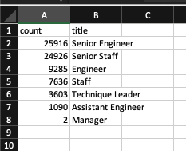

# Module 7 Challenge: Silver Tsunami

## Overview

- This analysis uses PostgreSQL to query a database of Pewlett-Hackard employee data to determine how many positions will soon open due to retirement and what those positions are. 
- Further, the analysis determines what and how many employees are eligible for a mentorship program in development that would allow for a smoother transition as employees retire and new employees enter the Pewlett-Hackard community and/or new roles.

## Results 

### Retiring Employees

- 72,458 employees spread among the departments will soon retire from Pewlett-Hackard holding the following positions: 
    1. Senior Engineer
    2. Senior Staff
    3. Engineer
    4. Staff
    5. Technique Leader
    6. Assistant Engineer
    7. Manager
- Of these job titles, 70% of the soon-retiring employees hold positions as Senior Engineer or Senior Staff.
    - 25,916 Senior Engineer employees
    - 24,926 Senior Staff employees

### Mentorship Program

- 1,549 employees are eligible for the mentorship program, given the criteria of a birth date between 1 January 1965 and 31 December 1965.

- This amount of people will begin to address the issue of retiring employees, but it alone will note suffice.

## Summary

- 72, 458 employees will soon retire from their positions at Pewlett-Hackard.
    - 70% of those employees hold positions as Senior Engineer or Senior Staff.
- With only 1,549 employees eligible for the mentorship program, there are enough retirement-ready employees to mentor these more junior employees, but this program alone will not solve the problem.
- I suggest looking for more focused information to better target solutions:
    - Run a query to determine how many employees are eligible for the mentorship program holding junior staff and engineering positions grouped by Department.
    - Run a query to capture how many people are retiring grouped by department to better understand what areas of the company will be most affected and how to pinpoint effective mitigation strategies.